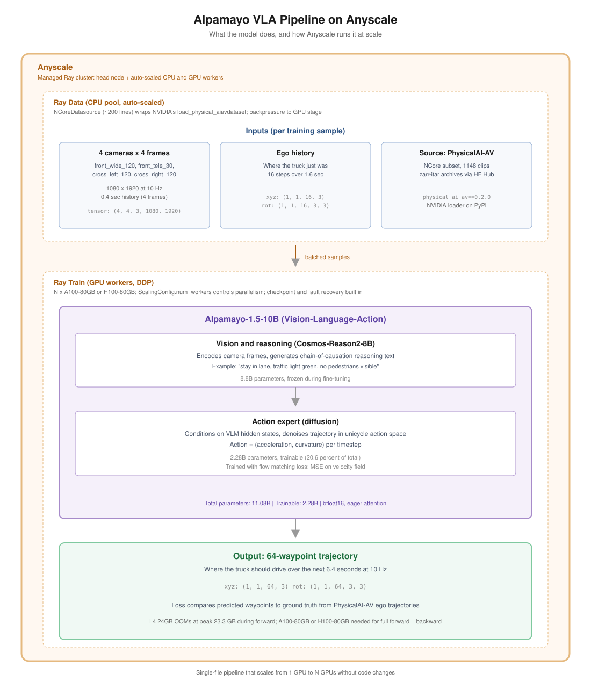

# Alpamayo VLA Pipeline

Distributed fine-tuning of NVIDIA's [Alpamayo-1.5-10B](https://huggingface.co/nvidia/Alpamayo-1.5-10B) vision-language-action model on the [PhysicalAI-Autonomous-Vehicles](https://huggingface.co/datasets/nvidia/PhysicalAI-Autonomous-Vehicles) dataset, built on Anyscale's Ray Data and Ray Train.



## What this does

Fine-tuning a VLA model involves two fundamentally different workloads:

1. **Data**. Streaming and decoding multi-camera autonomous-driving clips, aligning sensor timestamps, building per-frame samples ready for the model. CPU-heavy, I/O-heavy, embarrassingly parallel.

2. **Training**. Forward and backward passes on a 10B-parameter transformer with mixed precision and distributed data parallelism. GPU-heavy.

This pipeline splits the two cleanly:

* Ray Data handles step 1 on auto-scaled CPU workers and feeds batches to the GPU stage with backpressure.
* Ray Train handles step 2, launching distributed PyTorch workers across GPUs, wrapping the model in DDP, and managing checkpointing and fault recovery.

The result is a single-file pipeline that scales from 1 GPU to N GPUs by changing `ScalingConfig.num_workers`.

## Components

| File | Description |
|------|-------------|
| `src/ncore_datasource.py` | Ray Data datasource that streams PhysicalAI-AV samples via NVIDIA's `physical_ai_av` package. One row per `(clip_id, t0_us)` sample. |
| `src/cluster_setup.py` | Distributes Alpamayo dependencies to the system Python on every Ray worker. Required because Ray workers run from system Python, not the venv. |
| `src/alpamayo_loader.py` | Loads Alpamayo-1.5-10B from HuggingFace, freezes the Cosmos-Reason2-8B backbone (8.8B parameters), leaves the action expert trainable (2.28B parameters). |
| `src/action_loss.py` | Adds the flow matching training methods (`construct_training_data`, `compute_loss_from_pred`) to Alpamayo 1.5's `FlowMatching` class at runtime. Ported from NVIDIA's Alpamayo 1.0 SFT code. |
| `src/train_step.py` | Single training step: forward pass plus flow matching loss on predicted velocity field. |
| `tests/test_pipeline.py` | End-to-end smoke test. Loads the model on a GPU worker, fetches one real PhysicalAI-AV sample, runs forward and backward, asserts the loss is finite and gradients flow. |

## Setup

### 1. Dependencies

This template uses [uv](https://docs.astral.sh/uv/). From the project root:

```bash
uv venv
source .venv/bin/activate
uv sync
```

Note that `flash-attn` may fail to build in some environments. Alpamayo 1.5 supports `attn_implementation="eager"` as a fallback (slower but works everywhere).

### 2. HuggingFace access

The model and its backbone are gated, and the dataset is gated separately. Request access on each page:

* [Alpamayo-1.5-10B model](https://huggingface.co/nvidia/Alpamayo-1.5-10B)
* [Cosmos-Reason2-8B backbone](https://huggingface.co/nvidia/Cosmos-Reason2-8B)
* [PhysicalAI-Autonomous-Vehicles dataset](https://huggingface.co/datasets/nvidia/PhysicalAI-Autonomous-Vehicles)

Then authenticate:

```bash
export HF_TOKEN=hf_...
hf auth login --token $HF_TOKEN
```

### 3. Distribute dependencies to Ray workers

Ray workers run from system Python, not the venv. Run this once after starting the cluster:

```bash
python src/cluster_setup.py
```

This installs the required packages on every alive node.

## GPU Requirements

| Configuration | VRAM | Notes |
|---------------|------|-------|
| Inference (single sample) | ~24 GB | Tested on H100 80GB per Alpamayo's model card |
| Inference (multi-sample with CFG) | ~60 GB | Tested on H100 80GB |
| Training (forward only, frozen backbone) | ~23 GB peak | Action expert forward pass |
| Training (forward + backward) | A100-80GB or H100-80GB | L4 24GB OOMs at peak 23.3 GB before the backward graph is allocated |

For distributed training, request `accelerator_type="A100"` (or `"H100"`) in `ScalingConfig`. The pipeline runs on as few as 1 GPU and scales linearly with `num_workers`.

## Quickstart

```python
import os
import sys

os.environ.pop("RAY_RUNTIME_ENV_HOOK", None)
sys.path.insert(0, "src")

import ray
from ncore_datasource import NCoreDatasource

HF_TOKEN = os.environ["HF_TOKEN"]
ray.init(
    runtime_env={
        "working_dir": "src",
        "env_vars": {"HF_TOKEN": HF_TOKEN},
    },
)

ds = ray.data.read_datasource(
    NCoreDatasource(samples_per_clip=1, max_clips=5)
)
print(f"Total rows: {ds.count()}")
print("Keys:", list(ds.take(1)[0].keys()))
```

For a full training step on a GPU worker:

```bash
python tests/test_pipeline.py
```

## References

* Alpamayo 1.5 inference repository: [NVlabs/alpamayo1.5](https://github.com/NVlabs/alpamayo1.5)
* Alpamayo 1.0 (ships SFT and RL fine-tuning code): [NVlabs/alpamayo](https://github.com/NVlabs/alpamayo)
